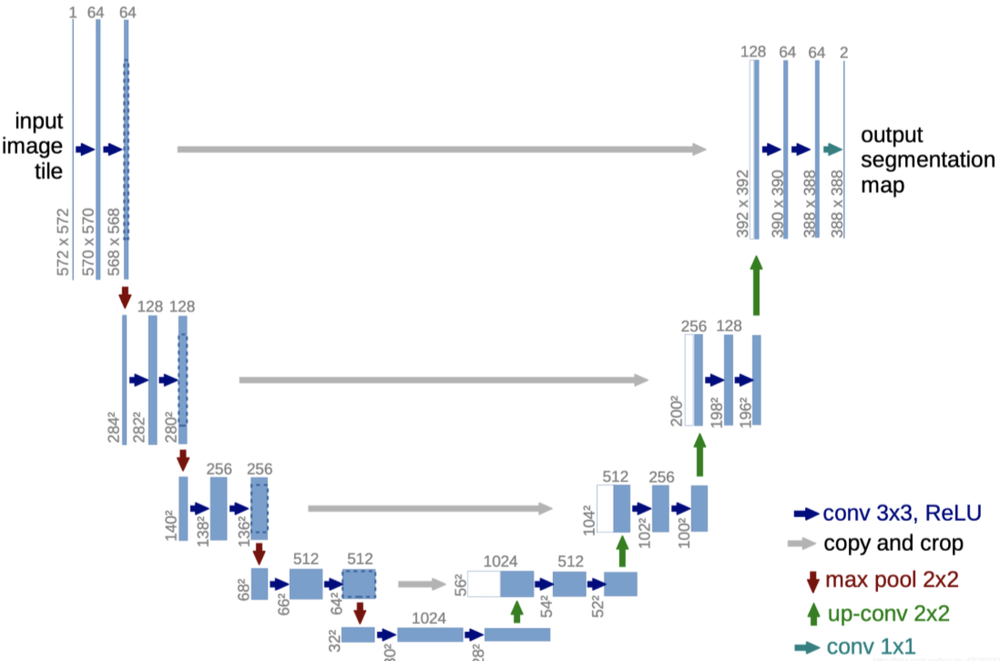
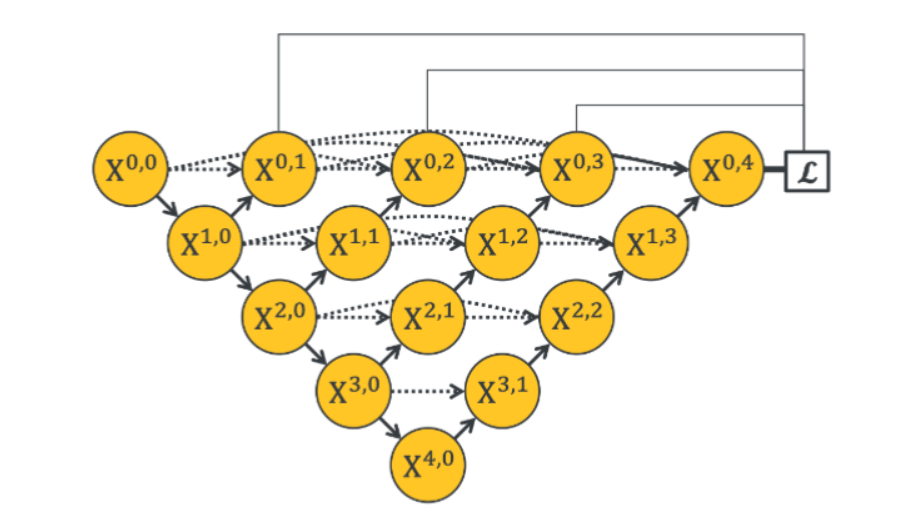

# 图像分割

图像分割是一种计算机视觉技术，通过将图像划分为多个部分或区域，从而简化图像的表示，使其更易于分析。图像分割的目标是将图像中的不同对象或区域分开，以便进一步的处理和分析。图像分割在医学影像分析、自动驾驶、遥感图像处理等领域有广泛的应用。

图像分割可以分为以下几种类型：

1. **语义分割 (Semantic Segmentation)**：
    - 语义分割的目标是为图像中的每个像素分配一个类别标签。也就是说，语义分割关注的是区分图像中的不同类型的对象或区域，但不区分同一类别的不同实例。
    - 例如，在一张街景图像中，语义分割可能会将所有的道路像素标记为一种颜色，将所有的车辆像素标记为另一种颜色。
    - 常用的语义分割模型包括 FCN (Fully Convolutional Networks)、U-Net、DeepLab 等。

2. **实例分割 (Instance Segmentation)**：
    - 实例分割不仅要为每个像素分配类别标签，还要区分同一类别的不同实例。换句话说，实例分割不仅要知道某个像素属于哪一类，还要知道它属于哪一个实例。
    - 例如，在一张街景图像中，实例分割不仅要将所有的车辆像素标记为车辆类别，还要区分出不同的车辆。
    - 常用的实例分割模型包括 Mask R-CNN 等。

# 语义分割中的常用损失函数

在语义分割的任务中，选择合适的损失函数对于模型的训练和性能提升至关重要。以下是一些常用的语义分割损失函数：

## 1. 交叉熵损失 (Cross-Entropy Loss)

交叉熵损失是分类任务中最常用的损失函数之一。在语义分割中，交叉熵损失用于衡量预测的类别概率分布与真实类别分布之间的差异。

公式如下：
$$
L_{CE} = -\frac{1}{N} \sum_{i=1}^N \sum_{c=1}^C y_{i,c} \log(\hat{y}_{i,c})
$$
其中：
- N 是像素数。
- C是类别数。
- $y_{i,c}$ 是像素 \(i\) 属于类别 \(c\) 的真实标签（one-hot 编码）。
- $\hat{y}_{i,c}$是像素 \(i\) 属于类别 \(c\) 的预测概率。

## 2. Dice 损失 (Dice Loss)

Dice 损失是一种用于衡量两个样本集合相似度的指标，特别适用于不平衡数据集。在语义分割中，Dice 损失用于衡量预测分割结果与真实分割结果之间的重叠程度。

公式如下：
$$
L_{Dice} = 1 - \frac{2 \sum_{i=1}^N y_i \hat{y}_i + \epsilon}{\sum_{i=1}^N y_i + \sum_{i=1}^N \hat{y}_i + \epsilon}
$$
其中：
- $y_i$是像素 \(i\) 的真实标签。
- $\hat{y}_i$ 是像素 \(i\) 的预测值。
- $\epsilon$ 是一个很小的数，防止分母为零。

## 3. Tversky 损失 (Tversky Loss)

Tversky 损失是 Dice 损失的推广，能够更好地处理类别不平衡问题。通过调节参数，可以控制假阳性和假阴性的惩罚。

公式如下：
$$
L_{Tversky} = 1 - \frac{\sum_{i=1}^N y_i \hat{y}_i + \epsilon}{\sum_{i=1}^N y_i \hat{y}_i + \alpha \sum_{i=1}^N y_i (1 - \hat{y}_i) + \beta \sum_{i=1}^N (1 - y_i) \hat{y}_i + \epsilon}
$$
其中：
- $\alpha$和$\beta$ 是控制假阳性和假阴性权重的参数。

## 4. Focal 损失 (Focal Loss)

Focal 损失是为了解决类别不平衡问题而提出的。它通过降低易分类样本的权重，集中关注难分类样本。

公式如下：
$$
L_{Focal} = -\frac{1}{N} \sum_{i=1}^N (1 - \hat{y}_{i,c})^\gamma y_{i,c} \log(\hat{y}_{i,c})
$$
其中：
- $\gamma$是调节难易样本权重的参数，通常取值为 2。

## 5. 混合损失 (Hybrid Loss)

在实际应用中，单一的损失函数可能无法充分优化模型，因此常常使用混合损失函数。混合损失函数将多个损失函数结合在一起，以利用各自的优点。

例如，交叉熵损失和 Dice 损失的混合损失可以表示为：
$$
L_{Hybrid} = \alpha L_{CE} + \beta L_{Dice}
$$
其中：
- $\alpha$ 和 $\beta$是混合损失函数中各损失的权重。

# 常用评估指标

##  IOU（Intersection over Union）

IOU是评估预测**边界框与真实边界框重叠程度**的指标。计算公式如下：
$$
\text{IOU} = \frac{\text{预测边界框与真实边界框的交集面积}}{\text{预测边界框与真实边界框的并集面积}}
$$
IOU在0到1之间取值，值越大表示预测边界框与真实边界框的重叠程度越高。

## MIOU (Mean Intersection over Union, MIOU)

平均交并比（MIOU）是评估图像分割模型性能的常用指标，通过计算预测结果与真实结果的交集和并集的比值，能够直观地反映出分割结果的质量。尽管 MIOU 在处理小物体和类别不平衡问题上存在一定的局限性，但其直观性和适用性使其成为语义分割任务中的重要评估指标。

## 定义

MIOU 是对每个类别的交并比（IOU）进行平均计算得出的。公式为：

$$
mIoU = \frac{1}{C} \sum_{c=1}^C IoU_c
$$
其中 C 是类别的总数。

# U-Net 网络

U-Net 是一种用于图像分割的卷积神经网络，由 Olaf Ronneberger 等人在 2015 年提出，最初用于生物医学图像分割任务。U-Net 以其对称的编码器-解码器架构和跳跃连接（skip connections）而著称，能够在处理小样本数据集时仍然表现出色。

## 架构

U-Net 的架构可以分为两个主要部分：编码器（下采样路径）和解码器（上采样路径）。编码器提取图像的特征，解码器逐步恢复图像的空间分辨率。跳跃连接用于将编码器中的特征直接传递到解码器的相应层，以保留更多的细节信息。

### 编码器（下采样路径）

编码器由若干个卷积层和池化层组成。每个卷积层后接一个 ReLU 激活函数，用于提取特征。池化层用于减小特征图的尺寸，从而逐步降低空间分辨率。

### 解码器（上采样路径）

解码器由若干个反卷积层（上采样层）和卷积层组成。反卷积层用于恢复特征图的空间分辨率。每个反卷积层后接一个卷积层和 ReLU 激活函数，用于逐步恢复图像的细节。

### 跳跃连接（Skip Connections）

跳跃连接将编码器中每一层的特征图直接传递到解码器的相应层。这种设计能够保留更多的细节信息，避免在上采样过程中丢失重要特征。

## U-Net 架构图

## 各层的输入输出详细说明

为了更好地理解 U-Net 的架构，我们将详细说明 U-Net 各层的输入和输出。假设输入图像的大小为 $572 \times 572 \times 1$（单通道灰度图像），我们将逐层分析其尺寸变化。

### 编码器（下采样路径）

### Layer 1: 输入层
- 输入：$572 \times 572 \times 1$
- 输出：$572 \times 572 \times 1$（未改变）

### Layer 2: 卷积层 1
- 输入：$572 \times 572 \times 1$
- 卷积核大小：$3 \times 3$，步长 1，无填充
- 输出：$570 \times 570 \times 64$

### Layer 3: 卷积层 2
- 输入：$570 \times 570 \times 64$
- 卷积核大小：$3 \times 3$，步长 1，无填充
- 输出：$568 \times 568 \times 64$

### Layer 4: 最大池化层 1
- 输入：$568 \times 568 \times 64$
- 池化窗口大小：$2 \times 2$，步长 2
- 输出：$284 \times 284 \times 64$

### Layer 5: 卷积层 3
- 输入：$284 \times 284 \times 64$
- 卷积核大小：$3 \times 3$，步长 1，无填充
- 输出：$282 \times 282 \times 128$

### Layer 6: 卷积层 4
- 输入：$282 \times 282 \times 128$
- 卷积核大小：$3 \times 3$，步长 1，无填充
- 输出：$280 \times 280 \times 128$

### Layer 7: 最大池化层 2
- 输入：$280 \times 280 \times 128$
- 池化窗口大小：$2 \times 2$，步长 2
- 输出：$140 \times 140 \times 128$

### Layer 8: 卷积层 5
- 输入：$140 \times 140 \times 128$
- 卷积核大小：$3 \times 3$，步长 1，无填充
- 输出：$138 \times 138 \times 256$

### Layer 9: 卷积层 6
- 输入：$138 \times 138 \times 256$
- 卷积核大小：$3 \times 3$，步长 1，无填充
- 输出：$136 \times 136 \times 256$

### Layer 10: 最大池化层 3
- 输入：$136 \times 136 \times 256$
- 池化窗口大小：$2 \times 2$，步长 2
- 输出：$68 \times 68 \times 256$

### Layer 11: 卷积层 7
- 输入：$68 \times 68 \times 256$
- 卷积核大小：$3 \times 3$，步长 1，无填充
- 输出：$66 \times 66 \times 512$

### Layer 12: 卷积层 8
- 输入：$66 \times 66 \times 512$
- 卷积核大小：$3 \times 3$，步长 1，无填充
- 输出：$64 \times 64 \times 512$

### Layer 13: 最大池化层 4
- 输入：$64 \times 64 \times 512$
- 池化窗口大小：$2 \times 2$，步长 2
- 输出：$32 \times 32 \times 512$

### Layer 14: 卷积层 9
- 输入：$32 \times 32 \times 512$
- 卷积核大小：$3 \times 3$，步长 1，无填充
- 输出：$30 \times 30 \times 1024$

### Layer 15: 卷积层 10
- 输入：$30 \times 30 \times 1024$
- 卷积核大小：$3 \times 3$，步长 1，无填充
- 输出：$28 \times 28 \times 1024$

### 解码器（上采样路径）

### Layer 16: 上采样层 1
- 输入：$28 \times 28 \times 1024$
- 上采样大小：$2 \times 2$，步长 2
- 输出：$56 \times 56 \times 512$

### Layer 17: 跳跃连接 1
- 输入：$56 \times 56 \times 512$（上采样层 1 输出） + $64 \times 64 \times 512$（编码器 Layer 12 输出，经过裁剪）
- 输出：$56 \times 56 \times 1024$

### Layer 18: 卷积层 11
- 输入：$56 \times 56 \times 1024$
- 卷积核大小：$3 \times 3$，步长 1，无填充
- 输出：$54 \times 54 \times 512$

### Layer 19: 卷积层 12
- 输入：$54 \times 54 \times 512$
- 卷积核大小：$3 \times 3$，步长 1，无填充
- 输出：$52 \times 52 \times 512$

### Layer 20: 上采样层 2
- 输入：$52 \times 52 \times 512$
- 上采样大小：$2 \times 2$，步长 2
- 输出：$104 \times 104 \times 256$

### Layer 21: 跳跃连接 2
- 输入：$104 \times 104 \times 256$（上采样层 2 输出） + $136 \times 136 \times 256$（编码器 Layer 10 输出，经过裁剪）
- 输出：$104 \times 104 \times 512$

### Layer 22: 卷积层 13
- 输入：$104 \times 104 \times 512$
- 卷积核大小：$3 \times 3$，步长 1，无填充
- 输出：$102 \times 102 \times 256$

### Layer 23: 卷积层 14
- 输入：$102 \times 102 \times 256$
- 卷积核大小：$3 \times 3$，步长 1，无填充
- 输出：$100 \times 100 \times 256$

### Layer 24: 上采样层 3
- 输入：$100 \times 100 \times 256$
- 上采样大小：$2 \times 2$，步长 2
- 输出：$200 \times 200 \times 128$

### Layer 25: 跳跃连接 3
- 输入：$200 \times 200 \times 128$（上采样层 3 输出） + $280 \times 280 \times 128$（编码器 Layer 7 输出，经过裁剪）
- 输出：$200 \times 200 \times 256$

### Layer 26: 卷积层 15
- 输入：$200 \times 200 \times 256$
- 卷积核大小：$3 \times 3$，步长 1，无填充
- 输出：$198 \times 198 \times 128$

### Layer 27: 卷积层 16
- 输入：$198 \times 198 \times 128$
- 卷积核大小：$3 \times 3$，步长 1，无填充
- 输出：$196 \times 196 \times 128$

### Layer 28: 上采样层 4
- 输入：$196 \times 196 \times 128$
- 上采样大小：$2 \times 2$，步长 2
- 输出：$392 \times 392 \times 64$

### Layer 29: 跳跃连接 4
- 输入：$392 \times 392 \times 64$（上采样层 4 输出） + $568 \times 568 \times 64$（编码器 Layer 4 输出，经过裁剪）
- 输出：$392 \times 392 \times 128$

### Layer 30: 卷积层 17
- 输入：$392 \times 392 \times 128$
- 卷积核大小：$3 \times 3$，步长 1，无填充
- 输出：$390 \times 390 \times 64$

### Layer 31: 卷积层 18
- 输入：$390 \times 390 \times 64$
- 卷积核大小：$3 \times 3$，步长 1，无填充
- 输出：$388 \times 388 \times 64$

### Layer 32: 卷积层 19（输出层）
- 输入：$388 \times 388 \times 64$
- 卷积核大小：$1 \times 1$，步长 1
- 输出：$388 \times 388 \times 2$（假设有 2 个类别）

## 损失函数

U-Net 常用的损失函数包括交叉熵损失（Cross-Entropy Loss）和 Dice 损失（Dice Loss）。在医学图像分割中，Dice 损失由于能够更好地处理类别不平衡问题，常被使用。

## 创新点

### 1. 对称的编码器-解码器架构

### 2. 跳跃连接（Skip Connections）

### 3. 全卷积网络（Fully Convolutional Network）

U-Net 是一种全卷积网络，即整个网络中没有全连接层，这使得模型可以接受任意大小的输入图像，并生成相应大小的分割结果。这种设计的优势包括：
- **适应不同大小的输入图像**：提高了模型的灵活性和实用性。
- **减少参数数量**：相比于包含全连接层的网络，全卷积网络的参数数量更少，训练更高效。

### 4. 多尺度特征融合

通过跳跃连接，U-Net 能够将不同尺度的特征进行融合。在编码器中，逐层提取的特征包含了从局部到全局的信息，而在解码器中，这些特征被逐步恢复并融合，从而生成高质量的分割结果。这种多尺度特征融合的设计使得 U-Net 在处理复杂场景和细节丰富的图像时表现出色。

### 5. 数据扩增（Data Augmentation）

U-Net 在训练过程中采用了数据扩增技术，通过对训练数据进行随机变换（如旋转、平移、缩放等），生成更多的训练样本。这有助于提高模型的泛化能力，尤其是在数据样本较少的情况下。

## 优点

1. **高效处理小样本数据集**：U-Net 在处理小样本数据集时表现出色，特别适用于医学图像分割等任务。
2. **保留细节信息**：跳跃连接能够有效保留细节信息，避免在上采样过程中丢失重要特征。
3. **简单易用**：U-Net 的架构简单明了，易于实现和扩展。

## 应用

U-Net 在多个领域的图像分割任务中取得了显著的效果，主要应用包括：
- **医学图像分割**：如器官、肿瘤和病灶的分割。
- **遥感图像处理**：如土地覆盖分类和目标检测。
- **自动驾驶**：如道路标志、车道线和障碍物的分割。

# U-Net++

U-Net++（也称为 Nested U-Net）是 U-Net 网络的改进版本，由 Zongwei Zhou 等人在 2018 年提出。U-Net++ 通过引入密集嵌套的跳跃连接和深层监督机制，进一步提升了图像分割性能。U-Net++ 主要应用于医学图像分割任务，但也可以推广到其他图像分割领域。

## 架构创新

U-Net++ 的主要创新点包括以下几个方面：

### 1. 嵌套的跳跃连接（Nested Skip Connections）

U-Net++ 引入了嵌套的跳跃连接，即在 U-Net 的基础上，每个编码器和解码器之间不仅有直接的跳跃连接，还增加了多个中间层的跳跃连接。这种设计使得特征图在不同尺度上进行更多次的融合，从而捕获更多的上下文信息和细节特征。

### 2. 深层监督（Deep Supervision）

U-Net++ 在每个解码器路径的输出都增加了监督信号（即损失函数）。这种深层监督机制有助于减轻梯度消失问题，并提高网络的训练效率和稳定性。通过在多个尺度上进行监督，U-Net++ 能够更好地学习到多尺度的特征。

### 3. 密集连接（Dense Connections）

U-Net++ 的跳跃连接采用了密集连接的策略，即每一层的输出不仅连接到下一层，还连接到所有后续层。这种密集连接的设计有助于特征的重复利用，进一步提高了模型的性能。

